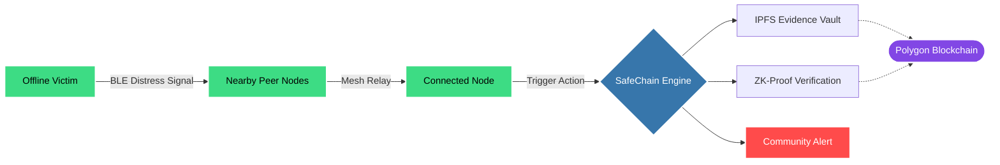
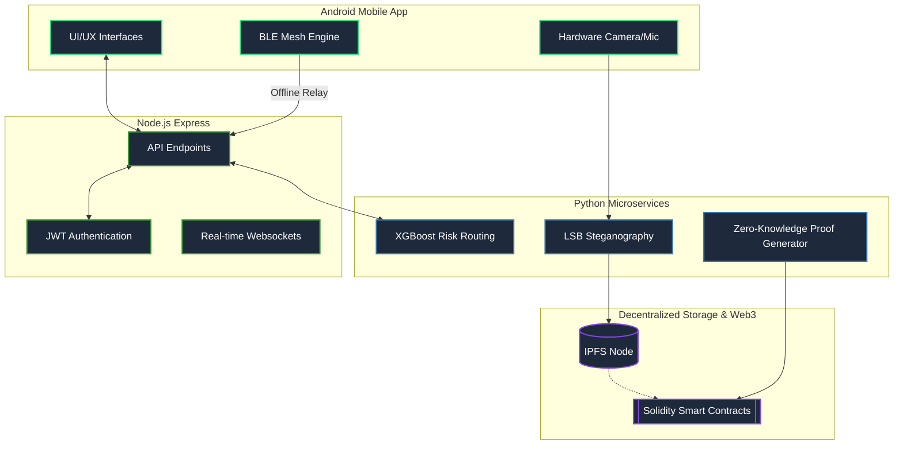
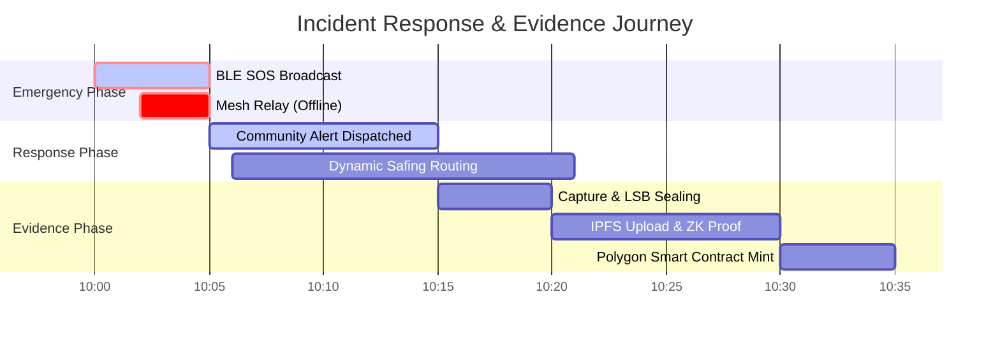
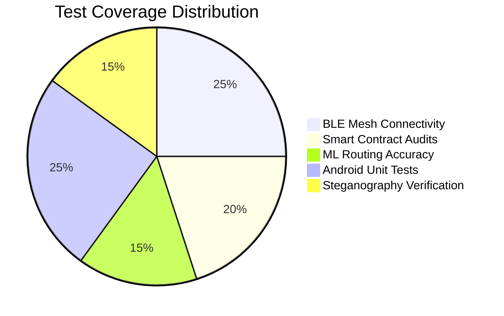
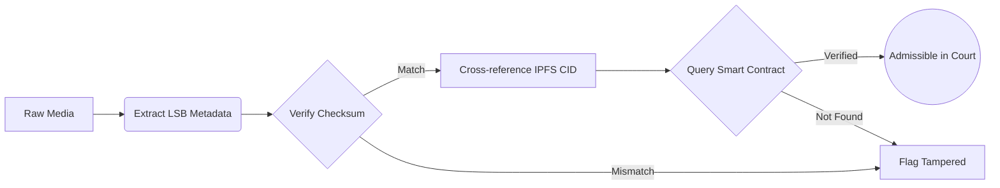

  <h1>🛡️ SafeChain</h1>
  <h3>Decentralized Offline-First Safety Ecosystem & Immutable Evidence Vault</h3>
  
  
  
  
  
  
  

  **Built for WomenTechies WT'26**

---

## 🎯 Problem & Impact

| 📶 82% | ⏳ 4-5 Mins | ⚖️ 60% |
| :---: | :---: | :---: |
| Emergencies occur in low/no connectivity areas | Average delay in centralized SOS routing | Of digital evidence is challenged for tampering |

---

## 💡 Our Solution: Offline BLE Mesh & On-Chain Security

SafeChain eliminates the dependency on cellular networks during emergencies and ensures that all captured evidence is cryptographically sealed and legally undeniable.

---

## 🏗️ Complete System Architecture

### High-Level System Design

---

## 📊 Real-World Example

### Complete Incident Lifecycle

### Detailed Lifecycle Breakdown

| Timestamp | Phase | Action | Status | Security Level |
| :--- | :--- | :--- | :--- | :--- |
| **10:00 AM** | `SOS TRIGGER` | Button held for 3s. No internet detected. | 🔴 Critical | High |
| **10:02 AM** | `MESH RELAY` | BLE signal picked up by Peer Device B | 🟡 Pending | Encrypted Payload |
| **10:05 AM** | `NETWORK FIX` | Peer B uploads encrypted SOS payload to Node | 🟢 Connected | JWT Auth |
| **10:15 AM** | `EVIDENCE` | Victim records audio. Steganography applied. | 🔵 Processing | LSB Embedded |
| **10:30 AM** | `BLOCKCHAIN` | Evidence CID minted to Polygon Network | 🟣 Immutable | ZK-Rollup |

---

## ⚙️ Core Modules Deep Dive

### 1. Offline BLE Mesh Network
- **Mechanism:** Utilizing Android's `BluetoothLeScanner` and `BluetoothGattServer` to bounce encrypted SOS payloads from phone to phone until an internet-connected node is reached.
- **Payload:** Encrypted Lat/Long + Hardware ID.

### 2. Predictive Safety Routing
- **Model:** Python-backed XGBoost Classifier.
- **Inputs:** Historical incident data, time of day, crowd density APIs, and illumination levels.
- **Output:** Safest generated coordinate path utilizing Google Maps SDK.

### 3. ZK-Proof Anonymous Reporting
Allows victims and whistleblowers to prove authenticity of their organizational identity (e.g., specific college or workplace) without revealing their actual identity, shielding them from retaliation.

---

## 🧪 Testing & Quality

### System Coverage Architecture

### Evidence Verification Flow

---

  <i>Empowering personal safety through decentralization.</i>

